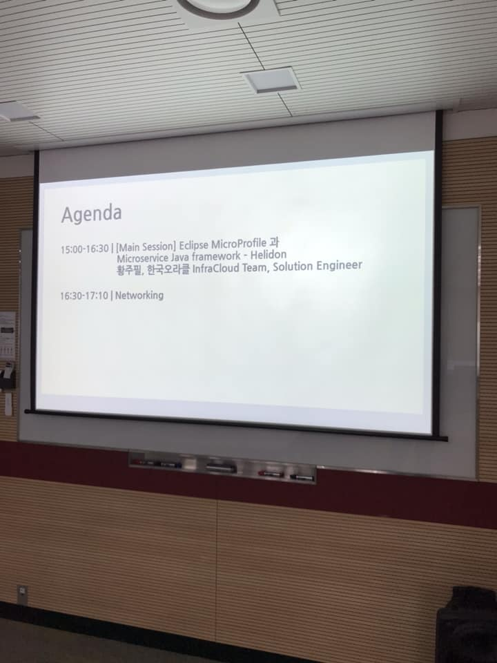
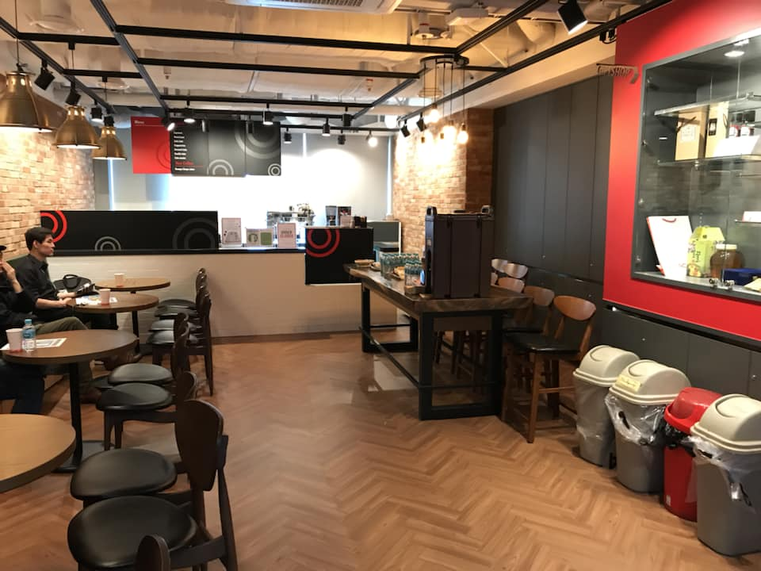

# 제 6회 Oracle Developer Meetup
 
2018년 5월 Oracle Developer Meetup은 "Apache Kafka"를 주제로 진행하였습니다. 카카오에서 Kafka 인프라를 운영하시고 최근에 Kafka 저서를 출간하신 고승범 님께서 "카프카, 데이터 플랫폼의 최강자"라는 주제를 발표해 주셨고 김태완 님께서 "관리형 Kafka 서비스 - Oracle Event Hub Service"를 소개하는 세션을 진행해 주셨습니다. 

- Meetup 주제: Apache Kafka
- 진행일시: 2018년 5월 19일 (토) 12:30-17:30
- 장소: 한국오라클 본사 (삼성동 아셈타워 15층)
- 참석자: 99명

## Meetup 아젠

|시간|세션|진행자|요약|자료|
|--|--|--|--|--|
|12:30-13:00|사전 등록 확인 및 입장||||
|13:00-13:10|인사의 말씀 및 공지사항|강인호(Oracle)|일정소개, Meetup 소개, IceBeaking||
|13:05-14:45|Session1: 분산 아키텍처를 지원하는 In-Memory OLTP Database - Oracle TimesTen 18.1|이병호(Oracle)|기존 In-Memory Database가 가지는 한계를 극복하고, 빠른 처리 속도와 확장(Scaleout)가능한 분산 아키텍처를 지원하는 In-Memory 관계형 Database인 Oracle TimesTen 18.1의 주요 특징을 소개합니다. 본 세션에서는 Oracle TimesTen의 분산 아키텍처와 주요 Feature를 소개하고 TimesTen 최신버전인 18.1의 데모를 진행할 예정입니다. 또한 현재 TimesTen을 이용하여 국내 통신사의 서비스를 개발하고 있는 이루온의 실제 적용 사례 및 성능 테스트 결과를 공유하는 시간이 될 것입니다.|[[PPT]()][[데모파일](https://www.oracle.com/technetwork/database/database-technologies/timesten/downloads/timesten-181-vm-download-4480199.html?fbclid=IwAR2urOrIRgJuP3jB7H0bKkXbfkNDZgmLQl1ZlhtYtSxyCFwk5QJdqqlyQv0)]
|14:45-15:00|Break||||
|15:00-16:30|Session2: - Eclipse MicroProfile 과 Microservice Java framework – Helidon |황주필(Oracle)|2016년에 만들어져, 현재 Eclipse Foundation에 기반을 두고 있는 Enterprise Java Microservices를 위한 Eclipse Microprofile에 대해서 알아보고, 간단한 데모를 진행합니다.Enterprise Java 표준(Java EE, 일명 EE4J)과 Microservices 기반 아키텍처의 실제 요구사항 사이를 차이를 좁히기 시작하였다. 여러가지 유용한 마이크로 서비스 관련 API를 기존 Java EE 7/8 API와 결합하여 사용하고, Heal Check, Metrics, Fault Tolerance, JWT Propagation, Configuration, Tracing 등을 제공하고 있습니다.이번 세션에서는 MicroProfile의 현재에 대해서 알아 보고, 기타 Microservices를 위한 java Micro framework에 대해서도 알아볼 것 입니다.|[[PPT]()]|
|16:30-17:10|네트워킹||참석자 간 네트워킹 및 다과||

## 현장 스케치

----

- 7회 오라클 밋업 아젠다

----

- 이번에도 다과를 준비했습니다.

빅데이터와 머신러닝, AI 등 최근 IT 트렌드를 얘기할 때 빼놓을 수 없는 카프카(Kafka)! 4차 산업혁명을 지원하는 IT인프라를 구축할 때 가장 근간이 되는 기술 중 하나가 실시간 데이터 처리 플랫폼이며, 그 중심에 자리잡은 오픈소스 프로젝트 카프카는 이제 선택이 아닌 필수가 되었습니다.

카프카는 고가용성, 고성능 분산 스트리밍 솔루션으로 기존 메시징 큐와 비교해 비휘발성과 내장애성이 높아, 최근 대기업과 스타트업을 가리지 않고, 데이터 플랫폼의 핵심 컴포넌트로서 도입하는 회사가 급속도로 증가하고 있습니다.

카프카라는 말을 듣고 물음표를 던지시는 개발자라면? 카프카를 제대로 이해할 수 있는 기회입니다. 바로 이번 밋업에 참석하셔서 카프카 최고의 전문가들로부터 도입 및 운영 노하우를 얻어가세요!

[일시 및 장소]

• 일시 : 2018년 5월 19일 (토) 12:30-17:30
• 장소 : 한국오라클 본사 (삼성동 아셈타워 15층 / 서울 강남구 영동대로 517 / 지하철 9호선 봉은사역 7번출구 도보 2분, 지하철 2호선 삼성역 6번출구 도보 7분)

[어젠다]

12:30-13:00 | 사전 등록 확인 및 입장

13:00-13:05 | 인사의 말씀 및 공지사항

13:05-14:35 | [Main Session] 카프카, 데이터 플랫폼의 최강자 | 고승범, 카카오 시스템셀 인프라팀
: 오늘날 빅데이터 분석, 처리부터 모든 개발 플랫폼을 연결해주는 카프카의 등장 배경과 의미를 살펴보고, 실무에서 적용한 경험을 바탕으로 적절한 카프카 사용 사례를 정비해 보겠습니다. 또한 카프카의 내부 구동 방식에 대하여 소개하는 시간을 갖겠습니다. 마지막으로 실무에서 카프카를 운영하면서 경험한 구성, 운영 및 모니터링 등 경험을 공유하는 시간을 갖겠습니다.
* 본 세션은 “입문자/초급자/중급자” 분들께 두루 적합한 세션입니다.

14:35-14:50 | Break

14:50-16:20 | [Demo session] 관리형 Kafka 서비스 - Oracle Event Hub Service | 김태완, 한국오라클 빅데이터 & Data Analytics 팀 부장
: 오라클 클라우드에서는 카프카를 관리형 서비스로 제공합니다. 밋업 세션에서는 관리형 카프카 서비스의 편의성을 소개하고 카프카 서비스의 데모를 진행합니다. 또한 MSA, 빅데이터 및 Blockchain의 인프라로 카프카가 핵심 위치를 갖는 것 뿐만 아니라 오라클 클라우드의 통합 핵심 컴포넌트로 카프카는 중요한 의미를 갖습니다.
오라클 클라우드의 통합 컴포넌트로 카프카의 역할과 주요 서비스의 구성을 소개합니다.
* 본 세션은 “입문자/초급자/중급자” 분들께 두루 적합한 세션입니다.

16:20-17:30 | 참석자 간 네트워킹 및 다과

[등록 및 기타 유의사항]

• 본 meetup 세션 중 열혈 참여자께 깜짝 선물을 드리며, 세션 후 '카프카, 데이터 플랫폼의 최강자' 저자와의 네트워킹 시간이 준비되어 있습니다.
• 본 밋업 전후 다과와 음료가 준비되며, 설문지를 제출해주시면 소정의 기념품이 제공됩니다.
• 주차비 지원이 되지 않으므로 가급적 대중교통을 이용해주시기 바랍니다.
• 기타 문의사항은 02-501-3614, oracle@mktg.co.kr 혹은 meetup 쪽지 (https://www.meetup.com/OracleDeveloperKR) 를 이용해주시기 바랍니다.
• 개발자를 위한 오라클 클라우드 사용자 그룹에 가입하시고 각종 밋업 및 유용한 클라우드 개발 정보를 받아보세요: More info _ Oracle Cloud User Group (https://www.facebook.com/groups/koreaoraclecloud)

# todo
- https://m.post.naver.com/viewer/postView.nhn?volumeNo=15866219&memberNo=38254758&fbclid=IwAR0_S_aOqLyWX_ahTwaRuYfr2HwTOQ5W3k3hLRZYcwzHknhTt8FMv_Ys1bc
- https://www.slideshare.net/OracleDeveloperkr/main-session-97867729?fbclid=IwAR3jDAoiCNpUnjwA83WKg4RQFDhyeTdm8hwwHirpHxD6WVS25M9YZkDTUxw
- https://www.slideshare.net/OracleDeveloperkr/demo-session-kafka-oracle-event-hub-service?fbclid=IwAR18vZWtnqQeb245LkHAGXBdfYX0pXuvXcPk03acY5SfgBRhJmXMe4W81iE
- https://www.facebook.com/innoshome/videos/1892300557467084/
- https://www.facebook.com/innoshome/videos/1892383347458805/

- 황주필님 문서 확보
- 이병호님 문서 확보