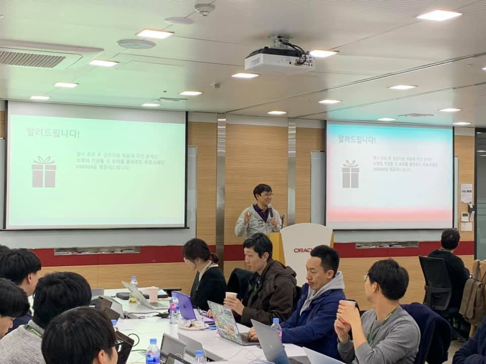
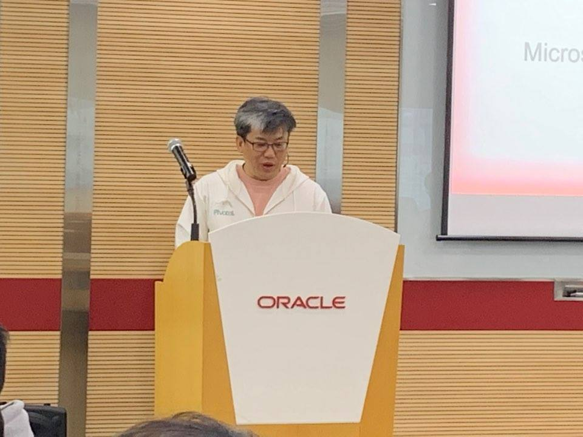
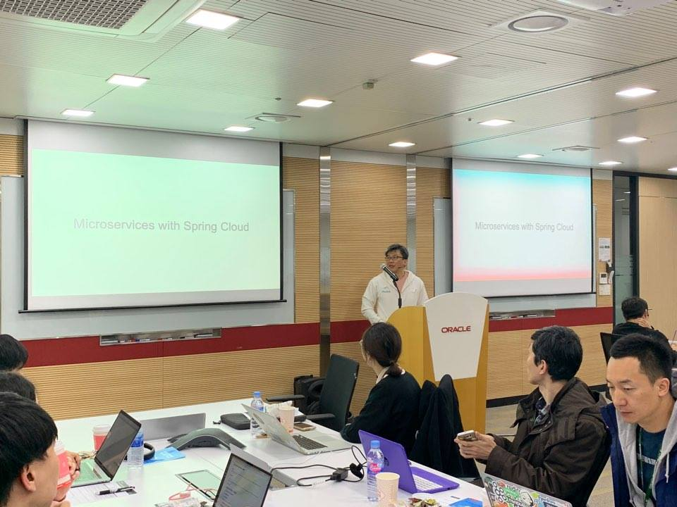
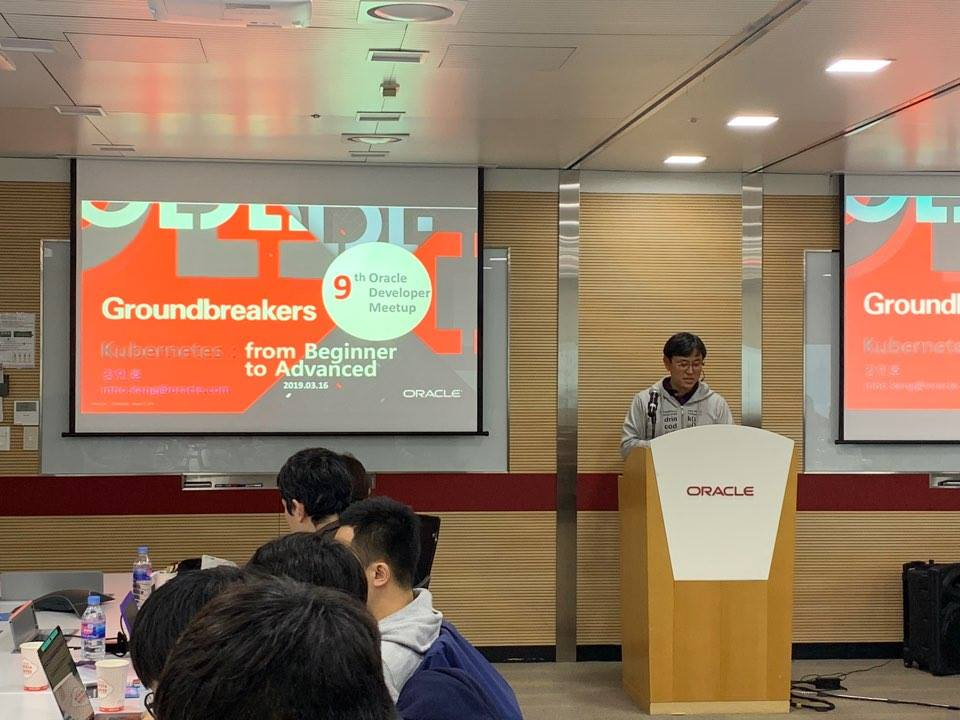
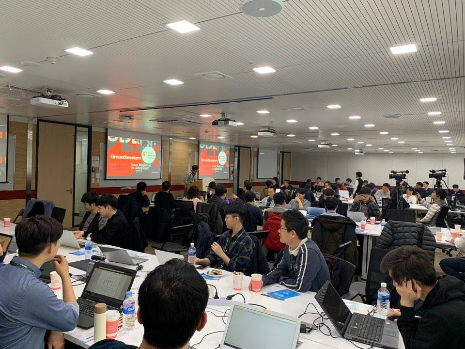
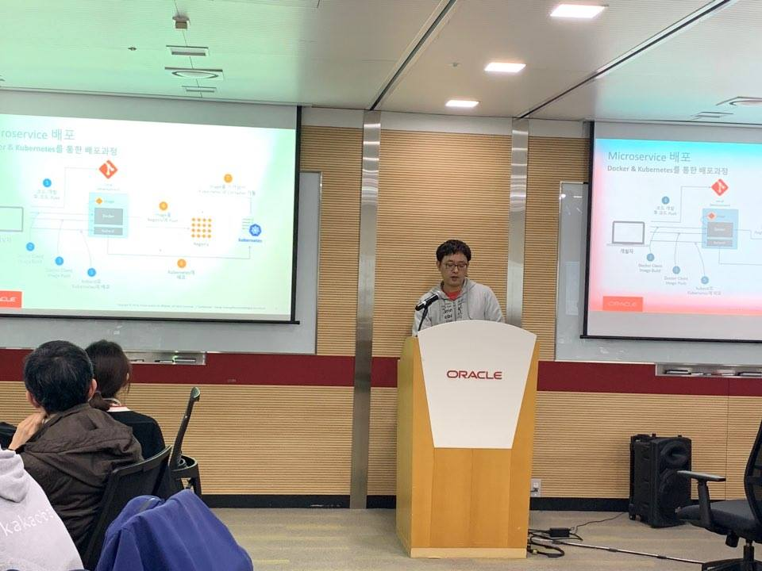
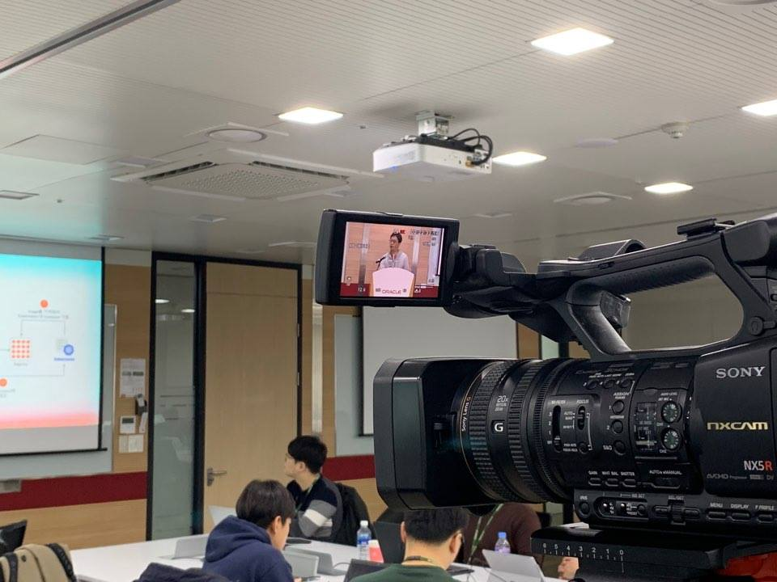
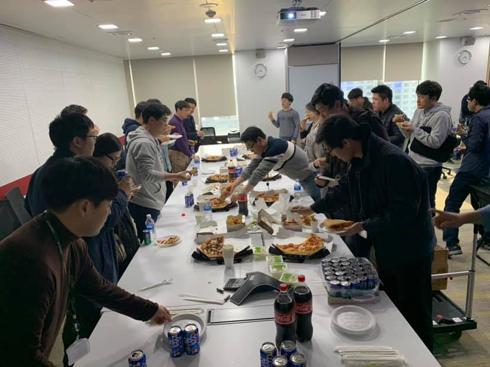

# 제 8회 Oracle Developer Meetup

2019년 3월에 Oracle Developer Meetup은 "Microservice, From beginner to Advanced"를 주제로 진행하였습니다. 피보탈 황주필 님께서 SpringBoot과 Spring Cloud Service에 대한 소개를 해주셨고, 오라클 강인호 님께서 Kubernetes 내부 구조를 소개하는 세션을 진행하셨습니다. 마지막으로 오라클 이동희님께서 MSA를 위한 CI/CD 핸즈온 세션을 했습니다. 

- Meetup 주제: [2nd GroundBreakers Meetup]Microservice, From beginner to Advanced
- 진행일시: 2019년 3월 14일 (토) 12:30-17:10
- 장소: 한국오라클 본사 (삼성동 아셈타워 15층)
- 참석자: 52명

## Meetup 아젠

|시간|세션|진행자|요약|자료|
|--|--|--|--|--|
|12:30-13:00|사전 등록 확인 및 입장||||
|13:00-13:10|인사의 말씀 및 공지사항|강인호(Oracle)|일정소개, Meetup 소개, IceBeaking||
|13:10-14:10|Session1: SpringBoot and Spring Cloud Service for MSA|황주필님(피보탈)|Cloud 환경에서 MSA를 하기 위해서 Service Discovery, Circuit Breaker 등을 사용하여 Application을 개발하는 방법과 Cloud에서 Kubernetes를 위시한 Container 생태계가 MSA에 미치는 영향 소개|[PPT](https://www.slideshare.net/namoo4u/microservices-with-kubernetes-190316)|
|14:10-14:20|Break||||
|14:20-15:20|Session2: Kubernetes : From beginner to Advanced|강인호(Oracle)|쿠버네티스의 구성요소(Master Node, Worker Node)에 대해서 기본적인 기능, 쿠버네티스의 내부 메커니즘 및 Networking 소개|[[PPT](https://www.slideshare.net/InhoKang2/kubernetes-from-beginner-to-advanced)]|
|15:20-15:30|Break||||
|15:30-16:30|Session3: Hands On : CI/CD 기반의 Microservice 개발 |이동희(Oracle)|마이크로서비스 기반의 간단한 웹 애플리케이션을 만들고, 오라클 컨테이너 기반 CI/CD 툴인 Wercker를 이용해 Oracle Kubernetes Engine에 배포 실습|[[PPT](https://www.slideshare.net/ssusera9c800/9thmeetup20190316cicd-microservice)], [[GIT](https://github.com/TheKoguryo/OKEwithWercker.v1.1)]|
|16:30-17:10|네트워킹||참석자 간 네트워킹 및 다과||

## 현장 스케치

----

- 9회 밋업에는 총 52분이 참석해 주셨습니다.

----

- 항상 밋엇 개요와 세션 소개을 맡아 주시고, 분위기를 잡아 주시는 강인호님

----

- 첫번째 세션을 진행해 주시는 황주필 님

----

- 첫번째 세션에서는 Spring boot과 마이크로서비스 생태계에 대해서 소개하는 시간을 갖었습니다.

----

- 두번째 세션에서는 Kubernetes Inside에 대해서 강인호 님께서 발표해 주셨습니다.

----

- 역시 Kubernetes에 대한 집중도는 최고였습니다.

----

- 이동희 님께서 진행해 주신 마지막 세션: CI/CD 핸드온

----

- 9회 밋업 세션은 모두 녹화했습니다. 녹화을 조만한 공개할 예정입니다.

----

- 오라클 밋업의 Siniture 피맥 입니다. 피맥과 함께 네트워크 시간을 갖었습니다.

