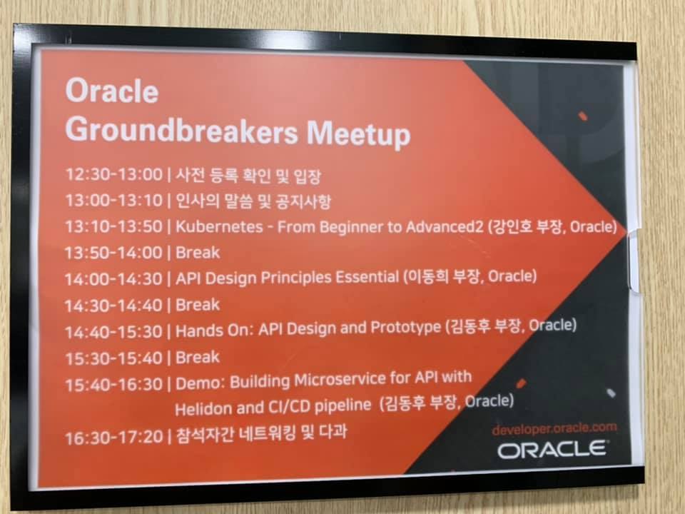
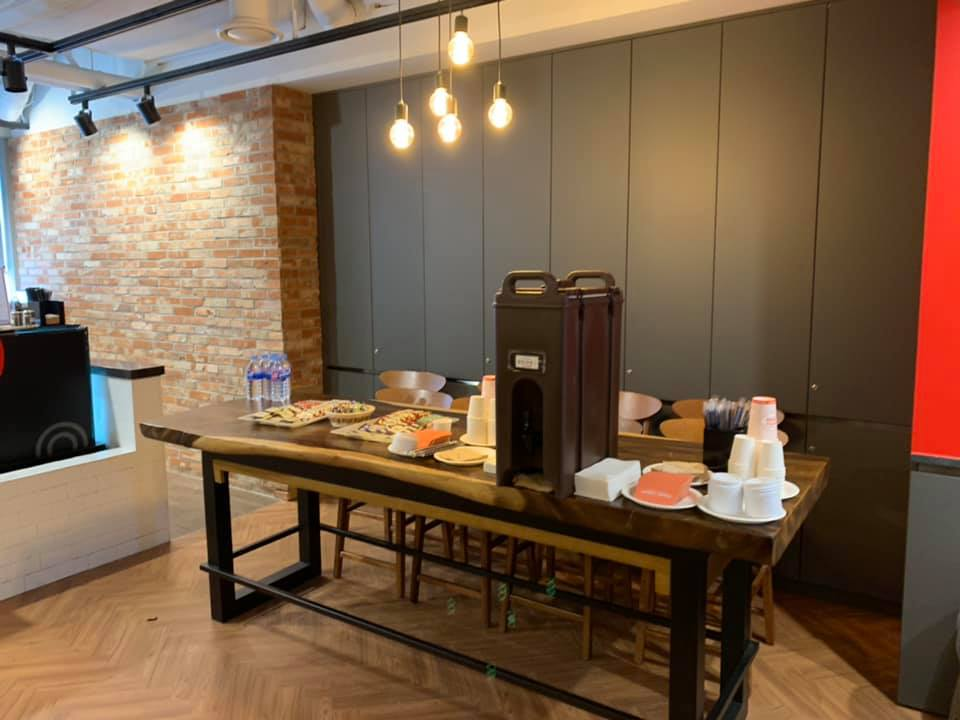
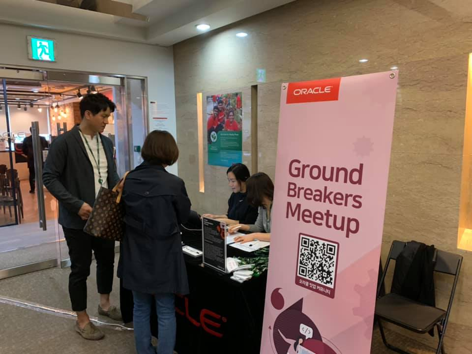
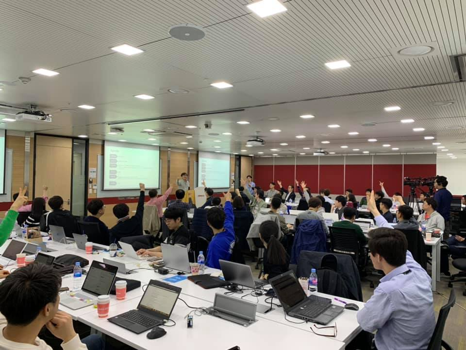
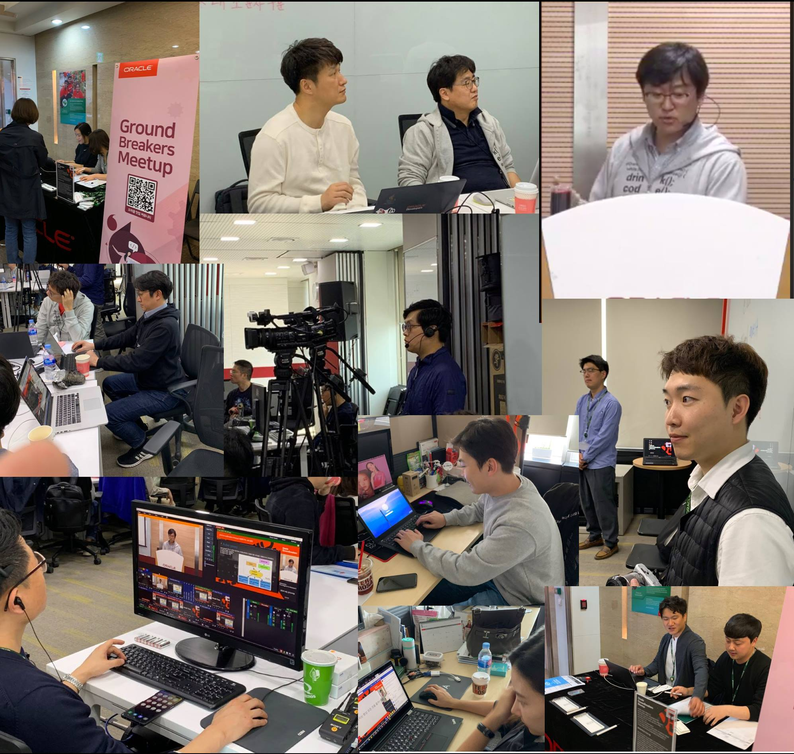

# 제 8회 Oracle Developer Meetup

2019년 5월 Oracle Developer Meetup은 "API"를 주제로 진행하였습니다. 강인호 님께서 지난 밋업에 이어서 "Kubernetes - From Begginer to Advanced 2"를 진행해 주셨고, 이동희 님께서 "API Design Principles Essential" 그리고 김동후 님께서 "Hands On: API Design and Prototyp"과 " Demo: Building Microservice for API with Helidon and CI/CD pipeline" 두 개 세션을 발표해 주셨습니다. 

- Meetup 주제: [3rd GroundBreakers Meetup] API
- 진행일시: 2019년 4월 20일 (토) 12:30-17:10
- 장소: 한국오라클 본사 (삼성동 아셈타워 15층)
- 참석자: 62명

## Meetup 아젠

|시간|세션|진행자|요약|자료|
|--|--|--|--|--|
|12:30-13:00|사전 등록 확인 및 입장||||
|13:00-13:10|인사의 말씀 및 공지사항|강인호(Oracle)|일정소개, Meetup 소개, IceBeaking||
|13:10-13:50|Session1: Kubernetes - From Begginer to Advanced 2|강인호(Oracle)|쿠버네티스의 다양한 workload의 활용법과 Kubernete의 네트워크, 그리고 Service Mesh로서의 Istio에 대해서 다룹니다.|[[PPT](https://www.slideshare.net/InhoKang2/k8s-beginner-2advancedep02201904221130post)]|
|13:50-14:00|Break||||
|14:00-14:30|Session2: - REST API Design Principles 되새기기 |이동희(Oracle)|기본적인 REST API에 대한 개념과 올바른 REST API 설계를 위한 가이드를 소개합니다.|[[PPT](https://www.slideshare.net/ssusera9c800/10thmeetup20190420rest-api-design-principles)]|
|14:30-14:40|Break||||
|14:40-15:30|Session3: Hands On: API Design and Prototype |김동후(Oracle)|마이크로서비스 기반의 간단한 웹 애플리케이션을 만들고, 오라클 컨테이너 기반 CI/CD 툴인 Wercker를 이용해 Oracle Kubernetes Engine에 배포 실습|[[PPT](https://www.slideshare.net/DonghuKIM2/api-design-and-prototype)], [[GIT](https://github.com/MangDan/meetup-190420-api)]|
|15:30-15:40|Break||||
|15:40-16:30|Session4: Building Microservice for API with Helidon and CI/CD pipeline |김동후(Oracle)| Eclispe Microprofile 기반 프레임워크인 Oracle Helidon에 대한 이해와 이를 활용한 마이크로 서비스 개발 방법을 시연하고 API 문서 검증, 서비스 빌드, 테스트 및 Oracle Kubernetes Engine에 배포하는 과정을 마이크로 서비스 CI/CD 서비스인 Oracle Wercker를 통해 자동화하는 과정을 소개합니다.|[[PPT](https://www.slideshare.net/DonghuKIM2/building-microservice-for-api-with-helidon-and-cicd-pipeline)], [[GIT]( https://github.com/MangDan/meetup-190420-api)]|
|16:30-17:20|네트워킹||참석자 간 네트워킹 및 다과||

## 현장 스케치

----

- 10회 밋업 일정표

----

- 참석자를 위하여 다과를 항상 준비하고 있습니다.

----

- 15층 행사장 등록 모습입니다.

----

- 10회 밋업에 총 60여분이 참석해 주셨습니다.

----

- 오라클 밋업을 지원해주시는 스텝입니다. 밋업을 지원해주시는 15분의 스텝이 참여하고 있습니다.

