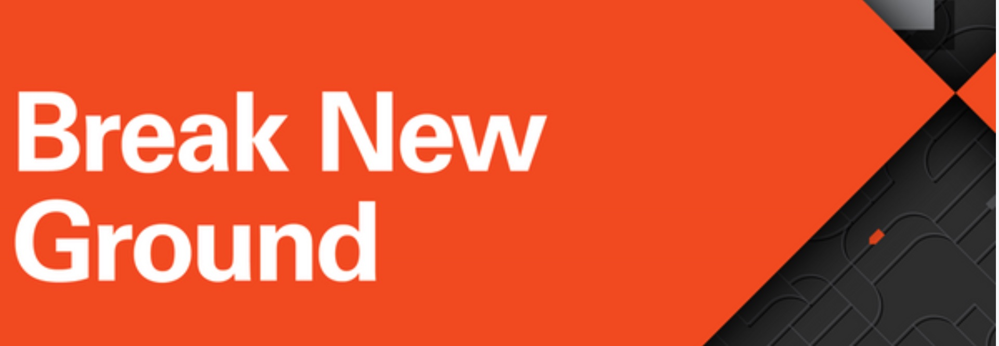
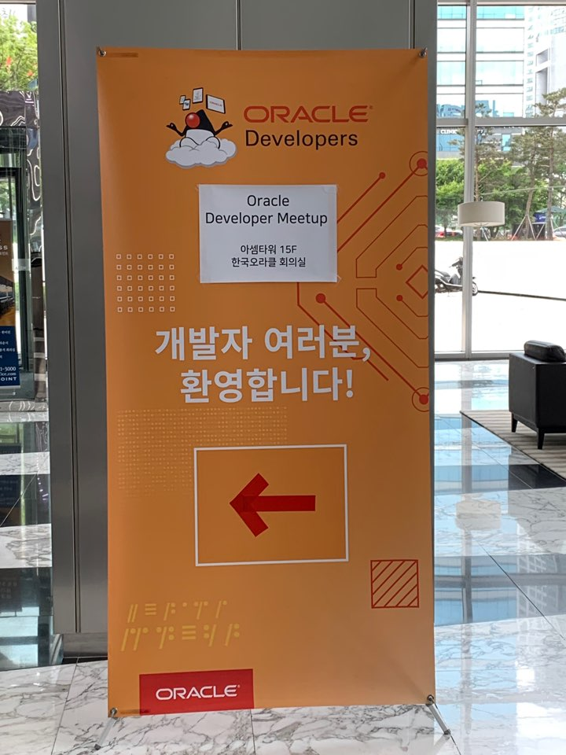
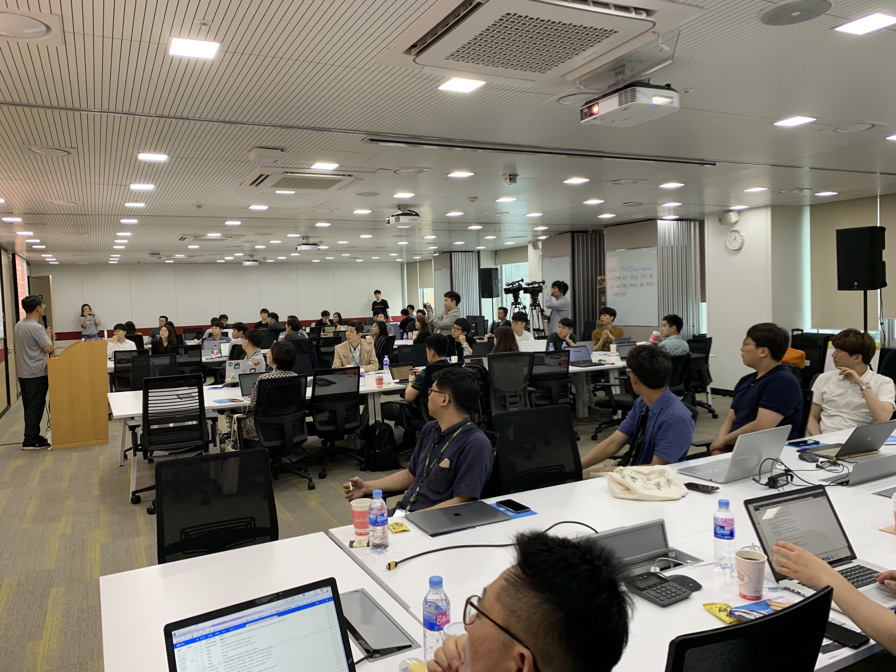
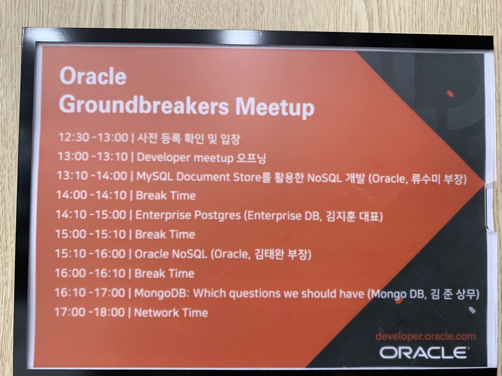
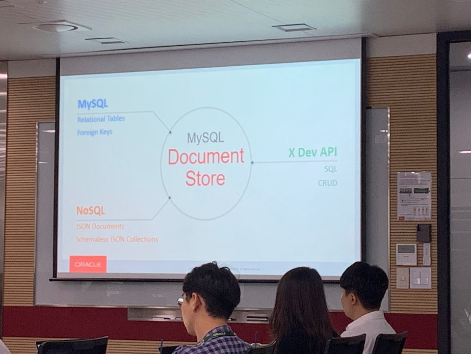
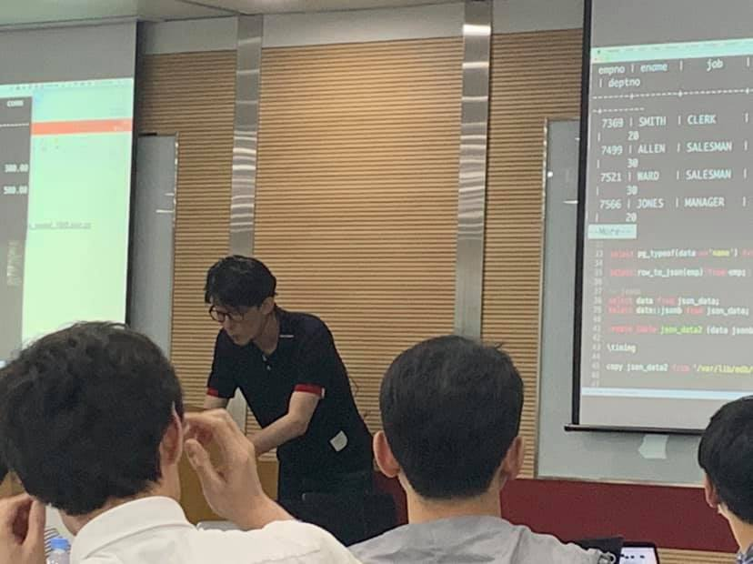
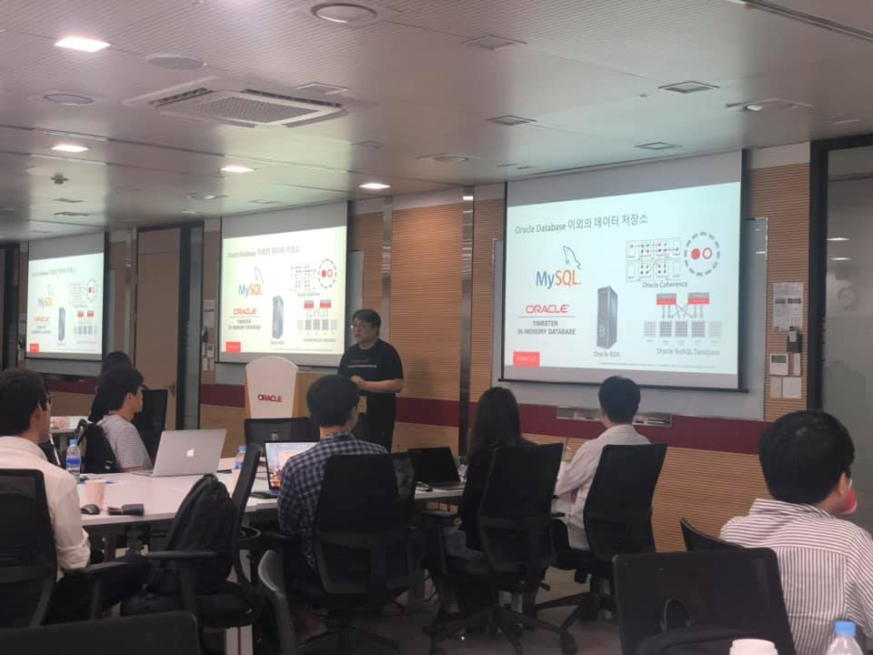
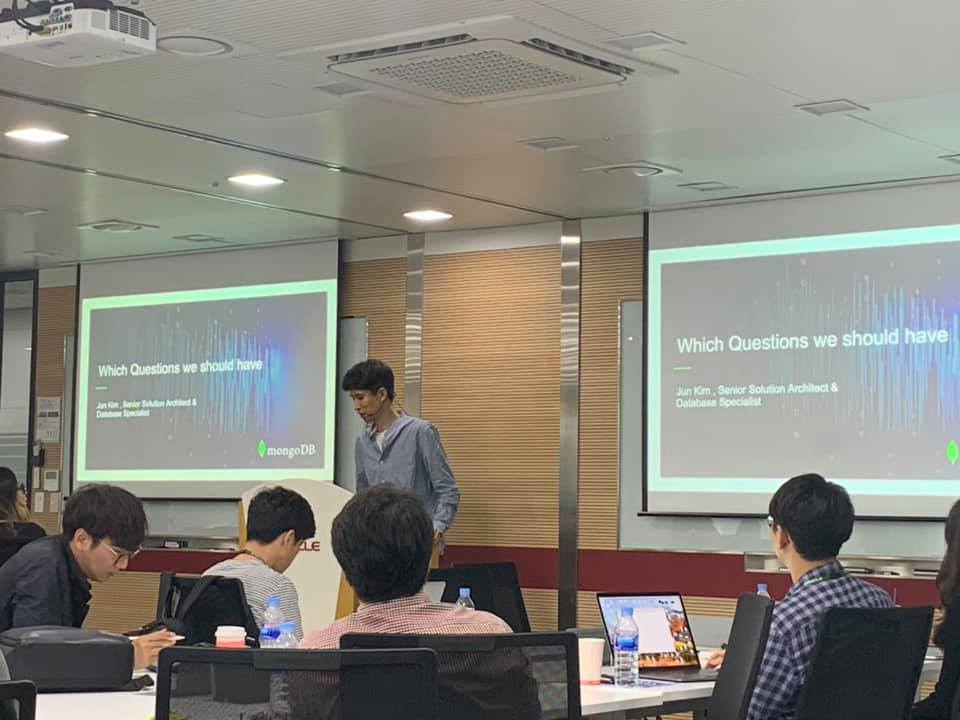

# 제 11회 Oracle Developer Meetup

2019년 5월 Oracle Developer Meetup은 "Cloud Native Database"를 주제로 진행하였습니다. MySQL, Enterprise Postgres, Oralce NoSQL, MongoDB의 4개 세션을 진행했습니다. EDB의 김지훈 이사님, MongoDB의 김준 상무님, 오라클의 김태완 부장님과 류수미 부장님이 발표자로 참석하셨습니다. 

- Meetup 주제: [4rd GroundBreakers Meetup] Cloud Native Database
- 진행일시: 2019년 5월 18일 (토) 12:30-18:00
- 장소: 한국오라클 본사 (삼성동 아셈타워 15층)
- 참석자: 52명

## 동영상
현재 동영상은 편집중입니다. __Youtube 동영상은 2주 후에 공개됩니다.__ 

## Meetup 아젠

|시간|세션|진행자|요약|자료|
|--|--|--|--|--|
|12:30-13:00|사전 등록 확인 및 입장||||
|13:00-13:10|인사의 말씀 및 공지사항|강인호(Oracle)|일정소개, Meetup 소개, IceBeaking||
|13:10-14:00|Session1: MySQL Document Store를 활용한 NoSQL 개발|류수미 부장(Oracle) |MySQL이 제고하는 JSON Doument 지원 기능 소개|[[발표문서](./docs/11th/201905-oraclemeetup_which-questions-we-should-have-oracle-meetup-version.pdf)], [[동영상]]|
|14:00-14:10|Break||||
|14:10-15:00|Session2: - Enterprise Postgres|김지훈 이사(Enterprise DB)|Postgres의 JSON 지원 기능과 외부 연동을 위한 FDW (Foreign Data Wrapper) 기능 소개|[[발표문서](./docs/11th/ODM_11_S02_Do_More_with_Postgres.pdf)][[동영상]]|
|15:00-15:10|Break||||
|15:10-16:00|Session3: Oracle NoSQL Database |김태완 부장(Oracle)|NoSQL의 주요 특징과 Oracle NoSQL의 아키텍처, 주요 기능 및 SQL 지원 소개|[[발표문서](https://www.slideshare.net/TaewanKim/11-oracle-developer-meetup-oracle-nosql-20190518-oraclenosql-publishing)], [[동영상]]|
|16:00-16:10|Break||||
|16:10-17:00|Session4: MongoDB: Which questions we should have |김준 상무(MongoDB)|데이터 인프라를 구성함에 있어서 실무자가 고려해야 할 사항과 MongoDB의 지원 방식 소개|[[발표문서](./docs/11th/201905-oraclemeetup_which-questions-we-should-have-oracle-meetup-version.pdf)], [[동영상]]|
|17:00-18:00|네트워킹||참석자 간 네트워킹 및 다과||

## 현장 스케치

----

- 11회 밋업 안내 @아셈타워 1층

----

- 11회 밋업 시작, 강인호 님의 ICE Breaking 타임

----

- 11회 밋업 일정

----

- 11회 밋업 첫 번째 세션: 류수미 님의 "MySQL Document Store를 활용한 NoSQL 개발" 세션

----

- 11회 밋업 두 번째 세션: 김지훈 님의 힙한 스웩 넘치는 발표

- 11회 밋업 3 번째 세션: 김태완 님의 Oracle NoSQL 발표

----

- 11회 밋업 4 번째 세션: 데이터 아키텍처와 MongoDB를 발표해 주신 김준 님 

