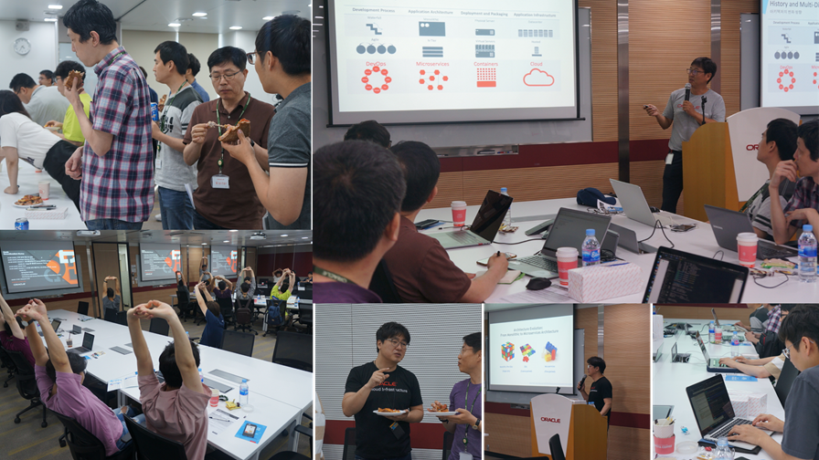

# 제 12회 Oracle Developer Meetup

2019년 6월 Oracle Developer Meetup은 "마이크로서비스 환경에서의 Monitoring과 Tracing!"을 주제로 진행하였습니다. "분산환경에서의 Tracing"과 ""스프링 부트 매트릭스 모니터링"을 주제로 2개 세션을 진행했습니다. 각 세션은 강인호님(Oracle)과 김동후님(Oracle)께서 진행해 주셨습니다.

- Meetup 주제: [5rd GroundBreakers Meetup] 마이크로서비스 환경에서의 Monitoring과 Tracing!
- 진행일시: 2019년 6월 15일 (토) 12:30-17:00
- 장소: 한국오라클 본사 (삼성동 아셈타워 15층)
- 참석자: 40명

## 동영상

현재 동영상은 편집중입니다. __Youtube 동영상은 2주 후에 공개됩니다.__

## Meetup 아젠

|시간|세션|진행자|요약|자료|
|--|--|--|--|--|
|12:30-13:00|사전 등록 확인 및 입장||||
|13:00-13:10|인사의 말씀 및 공지사항|강인호(Oracle)|일정소개, Meetup 소개, IceBeaking||
|13:10-14:30|Session1: 분산환경에서의 Tracing|강인호 부장(Oracle)|마이크로서비스 환경에서의 서비스간의 호출 관계를 추적할 수 있는 OpenTracing에 대한 소개하고 Jaeger를 활용한 실습|[발표문서](https://www.slideshare.net/InhoKang2/distributed-tracing-with-jaeger)|
|14:30-14:40|Break||||
|14:40-16:00|Session2: 스프링 부트 매트릭스 모니터링|김동후 부장(Oracle)|마이크로서비스 아키텍쳐에서의 분산된 서비스간의 모니터링 방법을 소개하고, 스프링 부트 기반의 마이크로 서비스 모니터링에 대한 실습|[[발표문서](https://www.slideshare.net/DonghuKIM2/spring-boot-microservice-metrics-monitoring-150100769?fbclid=IwAR011V37AS2qxs_T7iZuI1g3piWVSt1NE_CFYkkpFHY05jPPNC7_2WlpN5c)]|
|16:00-17:00|네트워킹||참석자 간 네트워킹 및 다과||

## 현장 스케치

----

- 12회 밋업 현장

----

- 12회 밋업, 김동후 선생님 발표
