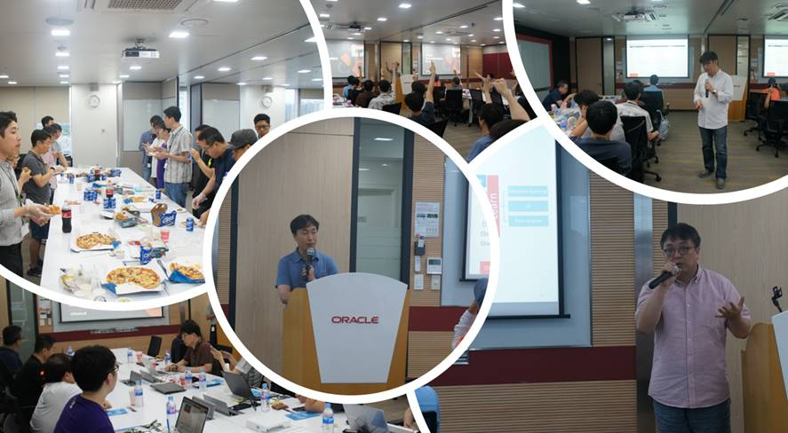
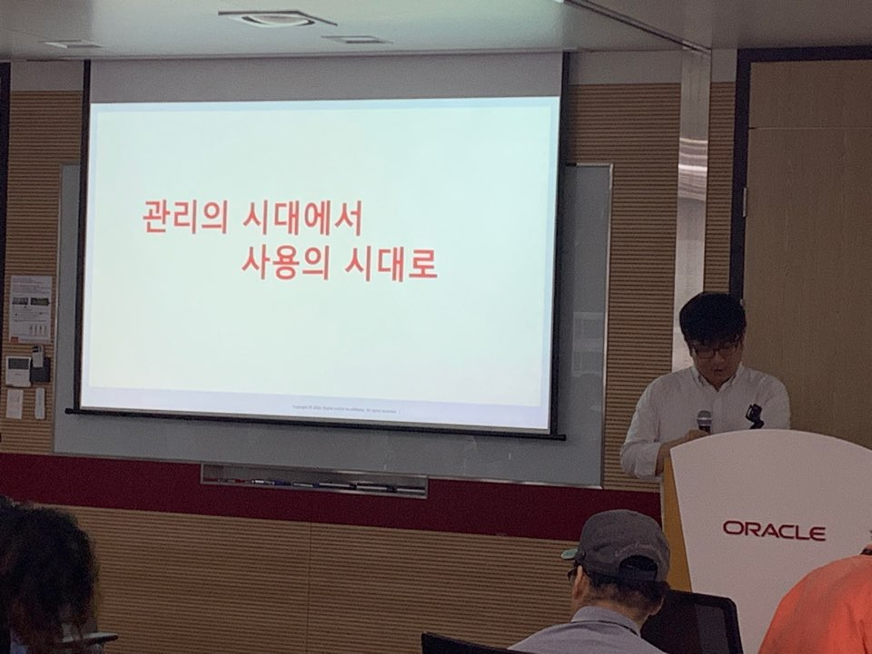

# 제 11회 Oracle Developer Meetup

2019년 7월 Oracle Developer Meetup은 "Oracle Autonomous Database를 밋업?"를 주제로 진행하였습니다. Oracle Autonomous DB에 대한 소개와 데이터베이스 및 데이터 동기화 서비스, Oracle Cloud Data Interface를 주제로 3개 세션을 진행했습니다. 각 세션은 이동욱님(Oracle), 신용환님(Oracle), 김태완님(Oracle)께서 진행해 주셨습니다.

- Meetup 주제: [6rd GroundBreakers Meetup] Oracle Autonomous Database를 밋업?
- 진행일시: 2019년 7월 20일 (토) 12:30-18:00
- 장소: 한국오라클 본사 (삼성동 아셈타워 15층)
- 참석자: 20명

## 동영상
현재 동영상은 편집중입니다. __Youtube 동영상은 2주 후에 공개됩니다.__

## Meetup 아젠

|시간|세션|진행자|요약|자료|
|--|--|--|--|--|
|12:30-13:00|사전 등록 확인 및 입장||||
|13:00-13:10|인사의 말씀 및 공지사항|강인호(Oracle)|일정소개, Meetup 소개, IceBeaking||
|13:10-14:00|Session1: Oracle Cloud Database 서비스: ADW & ATP|이동욱 부장(Oracle) |Oracle Autonomous Database||
|14:00-14:10|Break||||
|14:10-15:00|Session2: On-premise DB와 Cloud Database 통합|신용환 부장(Oracle)| DIPC를 이용하여 On-premise와 Cloud Database의 연동|[[발표문서](./docs/13th/On-premise DB와 Cloud Database 통합_201907.pdf)][[동영상]]|
|15:00-15:10|Break||||
|15:10-16:00|Session3: Oracle Cloud Data Services|김태완 부장(Oracle)|Oracle Cloud의 데이터 통합 서비스 구성|[[발표문서](https://www.slideshare.net/TaewanKim/13-oracle-developer-meetup-oracle-cloud-data-interface20190720)], [[동영상]]|
|16:00-17:10|네트워킹||참석자 간 네트워킹 및 다과||

## 현장 스케치

----

- 13회 밋업 발표3

----

- 13회 밋업, 이동욱 선생님 멋짐 뿜뿜 맨트
----

- 13회 밋업, 이동욱 선생님 방어막 시전.

----

- 11회 밋업 첫 번째 세션: 류수미 님의 "MySQL Document Store를 활용한 NoSQL 개발" 세션

----

- 11회 밋업 두 번째 세션: 김지훈 님의 힙한 스웩 넘치는 발표

- 11회 밋업 3 번째 세션: 김태완 님의 Oracle NoSQL 발표

----

- 11회 밋업 4 번째 세션: 데이터 아키텍처와 MongoDB를 발표해 주신 김준 님
