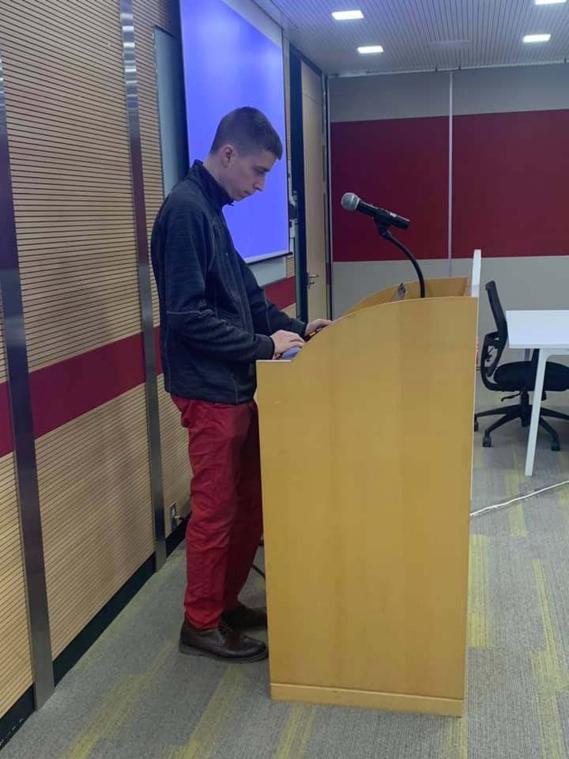
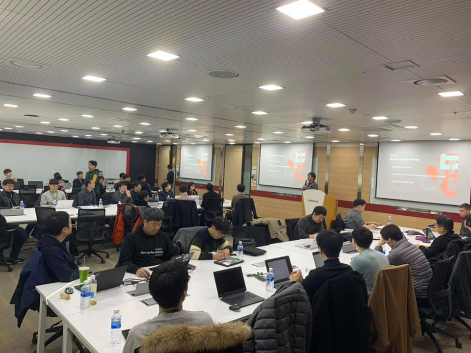
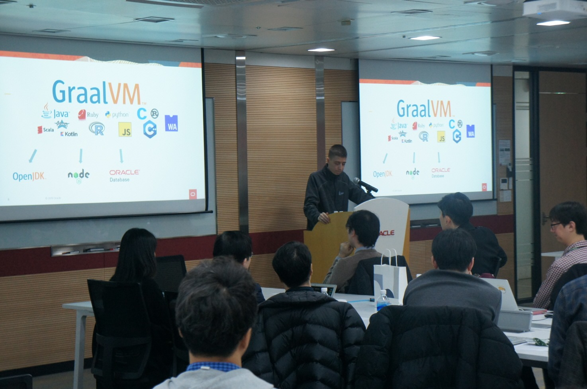
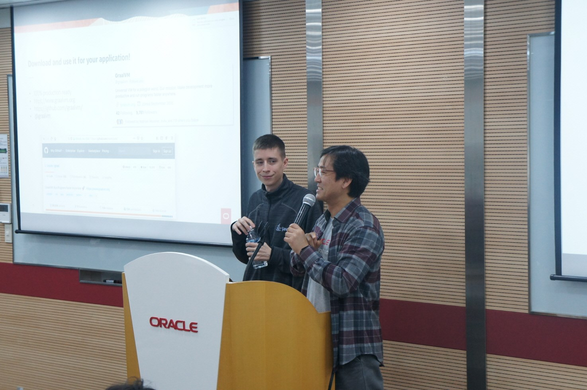
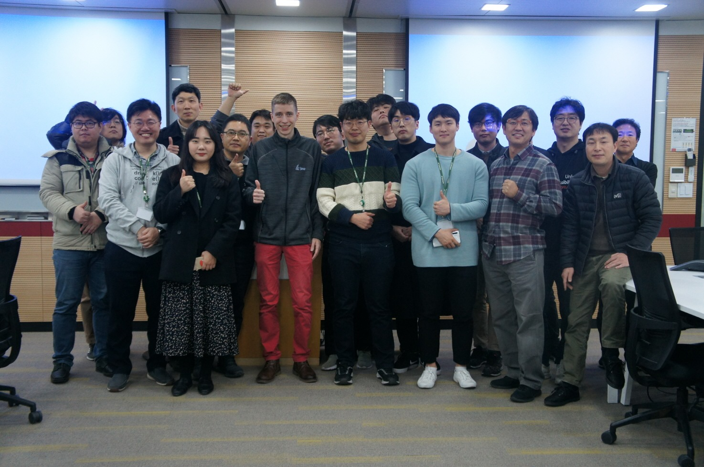

# 제 15회 Oracle Developer Meetup

2019년 12월 14일 15번째 Oracle Developer Meetup은 "GraalVM"를 주제로 진행하였습니다. GraalVM의 개념을 처음 제안하고 현재 GraalVM 개발 리더로 참여하고 있는 'Thomas Wuerthinge'님이 150분간 GraalVM 개요와 데모를 진행해 주셨습니다.

- Meetup 주제: [8th GroundBreakers Meetup] GraalVM
- 진행일시: 2019년 12월 14일 (토) 14:00-17:00
- 장소: 한국오라클 본사 (삼성동 아셈타워 15층)
- 참석자: 44명

## Meetup 아젠

|시간|세션|진행자|요약|자료|
|--|--|--|--|--|
|13:30-14:00|사전 등록 확인 및 입장||||
|14:00-14:10|인사의 말씀 및 공지사항|강인호(Oracle)|일정소개, Meetup 소개, IceBeaking||
|14:10-16:40|GraalVM|Thomas Wuerthinge(Oracle)|GraalVM 소개와 데모|[[발표문서](./docs/15th/GraalVM_Overview_Compact.pdf)]|
|16:40-17:10|네트워킹||참석자 간 네트워킹 및 다과||

## 현장 스케치

----

- __Thomas Wuerthinge__ 발표 준비

----

- 15회 밋업, 강인호 부장님께서 진행해 주신 ICE Breaking
----

- 15회 밋업, GraalVM 발표 현장

- 15회 밋업, GraalVM 발표 후 QnA

- 15회 밋업, __Thomas Wuerthinge__와 함께한 기념 사진

2019년 12월 14일 Oracle Developer Meetup에서 진행한 GraalVM 세션 페이지 입니다. Thomas Wuerthinge가 발표한 세션의 발표 문서를 다운로드 할 수 있습니다.
