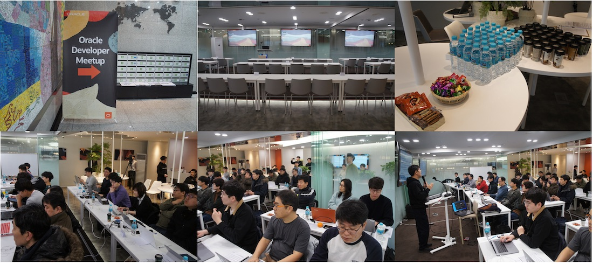
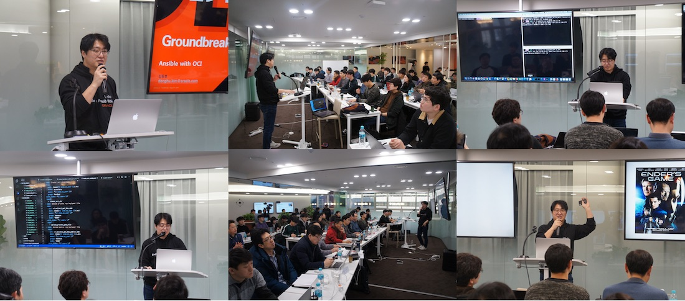
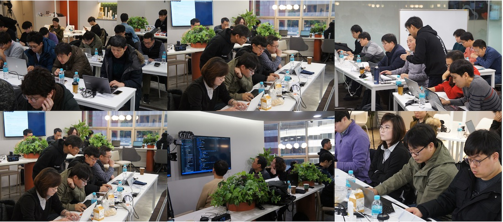
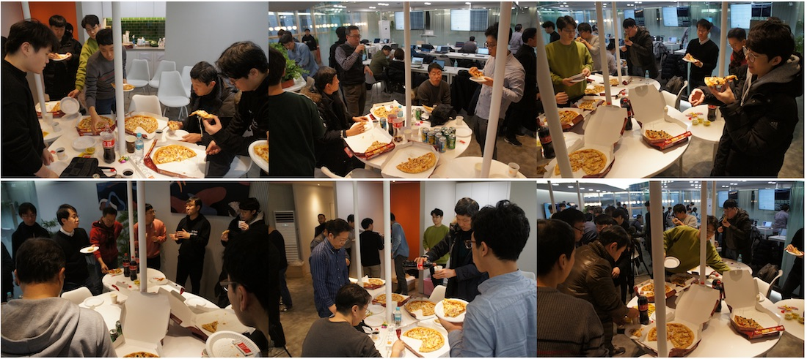

# 제 16회 Oracle Developer Meetup

2020년 12월 18일 16번째 Oracle Developer Meetup이 "Infra as Code"를 주제로 진행하였습니다. Infra as Code의 개념을 소개하고, Terraform, Ansible을 OCI에서 실습하는 세션을 진행했습니다. 

- Meetup 주제: 아홉번째 스토리 : 차근차근 알아보는 Infrastructure as Code
- 회차 정보
    - 16회차 Oracle Develoepr Meetup
    - 9회차 GroundBreakers Meetup (리브랜드 명)
- 진행일시: 2020년 1월 18일 (토) 14:00-17:00
- 장소: 강남 한국오라클 본사 (삼성동 아셈타워 15층)
- 참석자: 44명

## Meetup 아젠

|시간|세션|진행자|요약|자료|
|--|--|--|--|--|
|12:30-13:00|사전 등록 확인 및 입장||||
|13:00-13:10|인사의 말씀 및 공지사항|강인호(Oracle)|일정소개, Meetup 소개, IceBeaking||
|13:10-14:00|Infra as Code & Terraform|강인호님(Oracle)|IaC 개념과 테라폼 소개|[[발표문서](https://www.slideshare.net/InhoKang2/infra-as-code-with-packer-ansible-and-terraform)]|
|14:10-15:00|Ansible With OCI|김동후님(Oracle)|Ansible 소개와 OCI Ansible 모듈|강인호(Oracle)[[발표문서](https://www.slideshare.net/DonghuKIM2/ansible-with-oci-221441463)]|
|15:10-16:00|Terraform과 Ansible 실습|김동후님(Oracle)|OCI환경에서 Terraform과 Ansible 핸즈온|[[실습문서](https://github.com/MangDan/meetup-200118-iac)]|
|16:00-17:0|네트워킹||참석자 간 네트워킹 및 다과||

## 현장 스케치

----

- 강남역 CCOE에서 진행된 개발자 밋업 준비 및 등록

----

- 강인호님께서 진행하신 첫 번째 세션

----

- 김동후님께서 진행하신 두 번째 세션

----

- ansigle & Terraform 실습

----

- 밋업 네트워킹 타임

